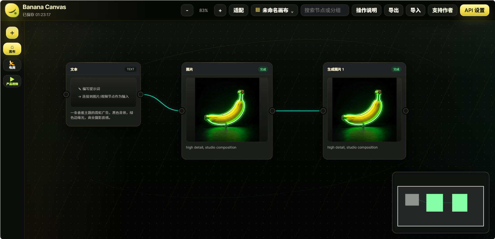
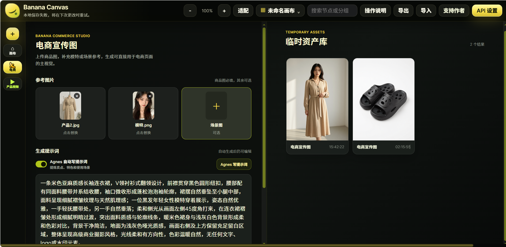
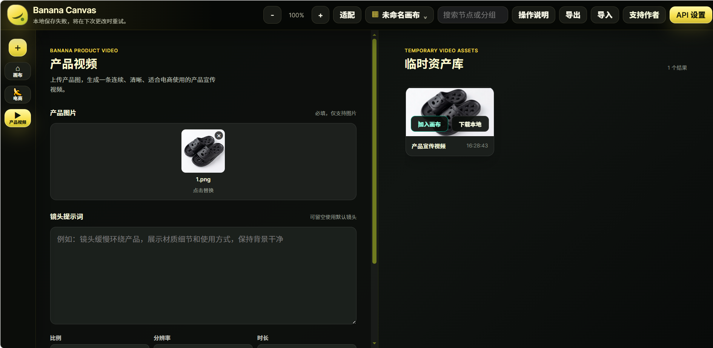

# Banana Canvas：免费开源的本地 AI 无限画布

Banana Canvas 是一个免费开源、本地优先的 AI 无限画布。用户可以通过节点、输入输出端口和连线组织图片、视频与文本资产，并接入 Agnes 或自己的多模态 API，构建本地 AI 图片和视频工作流。

> 如果这个项目对你有帮助，欢迎在右上角点个Star，支持项目持续维护。

## 核心特点

- 免费开源，本地运行，不需要云端账号。
- 点阵无限画布、节点、输入输出端口和连线工作流。
- 图片生成、视频生成、上传资产和结果资产管理。
- 支持 Agnes AI，也支持用户填写自己的自定义多模态 API。
- 支持图片、视频、文本之间的参考关系和提示词传递。
- 支持 Windows 和 macOS 本地启动。
- 画布、历史记录和临时资产优先保存在当前浏览器本地。
- 包含电商宣传图和产品宣传视频工作台。

## 适合谁

- 想使用免费开源 AI 无限画布的设计师、艺术家和导演。
- 需要组织图片、视频和文本生成流程的内容创作者。
- 想在本地使用自定义 AI API 的用户和开发者。
- 想寻找 RunningHub 类本地替代方案的用户。

## Project Facts

| 项目 | 说明 |
| --- | --- |
| 项目类型 | 免费开源、本地优先的 AI 无限画布 |
| 核心交互 | 节点、输入输出端口、连线和画布导航 |
| 主要输出 | AI 图片资产和 AI 视频资产 |
| API | Agnes AI 和自定义多模态 API |
| 平台 | Windows、macOS |
| 部署 | 本地 Node.js 服务，无第三方 npm 依赖 |
| 数据 | 当前浏览器本地存储和本地文件 |
| 云端依赖 | 不需要云端账号；生成请求依赖用户选择的 AI API |

## 界面预览

### 无限画布总览



### 电商工作台和临时资产库



### 产品视频工作台和临时资产库



## 启动

```powershell
npm start
```

打开：

```text
http://localhost:5177
```

## 小白用户：下载后双击使用

Windows 用户不需要安装 npm，不需要 `npm install`，也不需要命令行：

1. 在 GitHub 点击 `Code > Download ZIP` 并解压。
2. 确认电脑安装了 Node.js 18 或更高版本；没有安装时，双击 `start.bat` 会自动打开官方安装页面。
3. 双击项目根目录的 `start.bat`。
4. 浏览器会自动打开 `http://localhost:5177/`，然后在右上角 `API 设置` 中填写自己的 Agnes API Key。

服务窗口需要保持打开；要停止服务，关闭名为 `Banana Canvas Server` 的窗口即可。PowerShell 用户也可以运行 `start.ps1`。

项目没有第三方 npm 依赖，下载并解压后即可启动。

### macOS 用户

1. 下载并解压 ZIP，确认电脑安装了 Node.js 18 或更高版本。
2. 双击 `start.command`。
3. 如果 macOS 阻止第一次打开，在文件上点击右键，选择“打开”；或者在终端执行：

   ```bash
   chmod +x start.command start.sh
   ./start.command
   ```

终端会自动启动服务并打开浏览器。关闭该终端窗口即可停止服务。

## 操作习惯

- 点击左侧 `＋` 打开添加节点面板。
- 点击节点后，在节点下方的悬浮操作栏中编辑提示词、模型、比例、分辨率并提交生成。
- 从一个节点右侧输出端口拖到另一个节点左侧输入端口即可建立连线。
- 文本节点连到图片或视频节点时，会作为生成提示词上游输入。
- 图片或上传资产节点连到图片或视频节点时，会作为参考图输入。
- 在节点、节点操作面板或画布空白处按住鼠标中键可平移画布；普通滚轮垂直平移，`Ctrl+滚轮` 缩放。
- 左键点击节点进行选择；在空白处按住左键拖动可框选节点，按住 `Shift` 点击或框选可切换选择。
- 指针移动达到 4px 后才开始拖动，节点默认吸附到 16px 网格和相邻节点对齐参考线；按住 `Alt` 可绕过吸附。
- `Ctrl+D` 复制所选节点。点击连线可单独选择，按 `Delete` 或 `Backspace` 删除所选连线。
- 小地图支持点击定位、拖动导航和方向键移动。
- `Ctrl+Z` 撤销，`Ctrl+Shift+Z` 或 `Ctrl+Y` 重做。
- 在画布内点击鼠标右键会打开自定义菜单，不会弹出浏览器原生菜单。
- 生成完成后会自动创建结果资产节点；同一个节点多次生成时，每个结果都会创建独立节点。
- 画布和历史记录仅保存在当前浏览器本地；画布切换器可以新建、保存、重命名、删除和切换本地画布，不会同步到云端或其他浏览器。

## 电商宣传图和产品视频

左侧电商入口可以进入电商宣传图工作台；左侧产品视频入口可以进入产品视频工作台。

- 电商宣传图：上传商品图，可选上传模特图和场景图；可以使用 Agnes 自动生成单屏电商海报提示词，也可以手写提示词。
- 产品宣传视频：上传产品图，填写镜头提示词和视频参数后生成宣传视频。
- 生成结果可以预览、下载，或添加回无限画布继续组织。

## Agnes 默认接入

- Agnes AI 官网：[https://www.agnes-ai.com/](https://www.agnes-ai.com/)
- Base URL：`https://apihub.agnes-ai.com/v1`
- 图片生成：`POST /v1/images/generations`
- 默认图片模型：`agnes-image-2.1-flash`
- 自动提示词模型：`agnes-2.0-flash`，请求 `POST /v1/chat/completions`
- 视频生成：`POST /v1/videos`
- 默认视频模型：`agnes-video-v2.0`

## 当前功能

- 深色点阵无限画布和香蕉黄/绿色视觉主题。
- 节点平移、画布拖拽、框选、分组、连线和小地图。
- 文本、图片生成、视频生成和上传资产节点。
- 图片文生图、图生图、多参考图生成。
- 视频文生视频、图生视频和多关键帧视频生成。
- Agnes 视频异步任务轮询和错误退避。
- 画布 JSON 导入/导出、历史记录、撤销/重做和本地快照。
- 节点搜索、分组管理、依赖关系感知自动布局。
- 自定义 API 高级配置。
- 电商宣传图和产品宣传视频工作台。

## 不包含

- 专业视频剪辑器或时间线编辑器。
- 导演台或完整影视制作系统。
- 多用户云端协作。

## 开源协议

本项目使用 [MIT License](LICENSE)。
